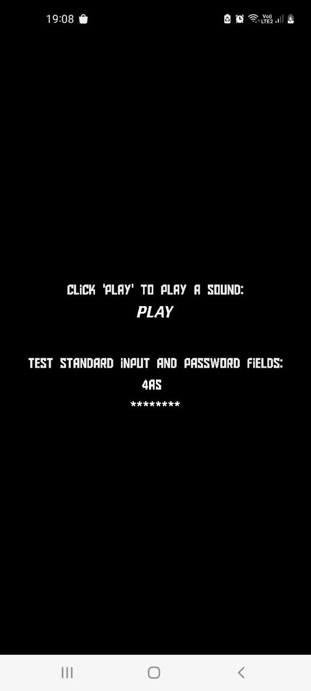

This directory contains the source code for an example Heaps app.  
It's set to produce the proper C code for Android compilation.  
Note: Comes with additional helper methods to handle Android text input through the software keyboard. You'll need it if your app takes any kind of input from the user, as Heaps doesn't have support for this by default. It also has a helper method for finding out a writable directory on a real device, in case you want to have save files.

If everything compiles correctly you should see a new folder "out" in this directory (it won't show up on GIT). It contains the exported C code, which you'll need to move to `/app/src/main/cpp/out`, and then build the Android app.

For reference, here's how this example app should look like running on a mobile phone:
  